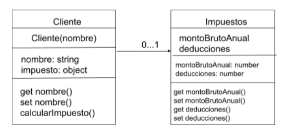

# Desafío - Clases en ES6

Este desafío consiste en aplicar los conocimientos de Programación Orientada a Objetos y ES6 para desarrollar un sistema de registro de clientes que calcule el impuesto anual que deben pagar. 

## 🛠️ Tecnologías y herramientas usadas

-  [JavaScript ES6](https://www.w3schools.com/Js/js_es6.asp)
- [Babel](https://babeljs.io/docs/)
- [Node.js 20.11.1](https://nodejs.org/en)

## 🚀 Implementación

1. Inicialización del proyecto npm en la terminal.
```
npm init -y
```

2. Creación de archivos JavaScript en ./assets/js e implementación para cada clase según el siguiente diagrama:



3. Creación del archivo babel.config.json

4. Transpilación del código JavaScript con la configuración de Babel en la terminal:

```
npx babel src/ -d dist/ --config-file ./babel.config.json

```